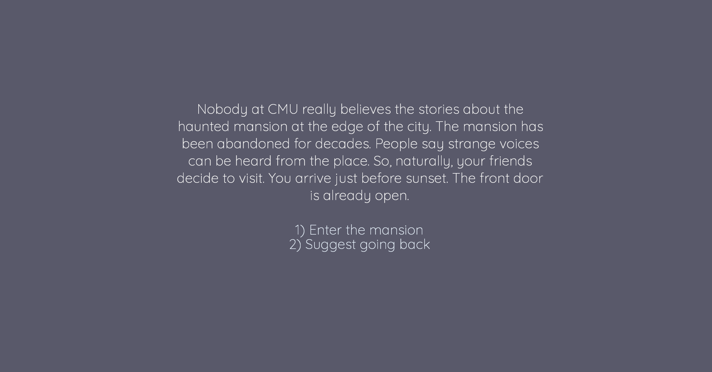

# (TODO: your game's title)

Author: (TODO: your name)

Design: This is an interactive story where player enters an old mansion in a forest where get trapped and encounters a horrifying creature. The player has to decide their actions to escape from the mansion. 

Text Drawing: The text is being rendered realtime. FreeType rasterizes the Quicksand font into a texture atlas. HarfBuzz then shapes them into positioned glyphs. 

Choices: The story is authored in Twine and exported as Json using the Twison story format. The game parses story.json into passages with prose and choices. The game tracks the current passage and jumps between passages on number-key input.

Screen Shot:

How To Play:

Use the number keys to select choices. Press R to go back. 

Sources: 

https://fonts.google.com/specimen/Quicksand?preview.script=Latn
License is placed in the folder. (OFL.txt)

This game was built with [NEST](NEST.md).

